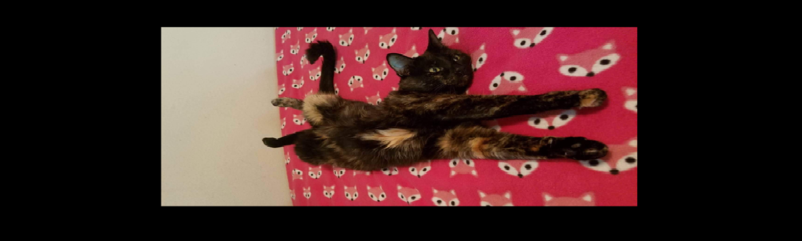
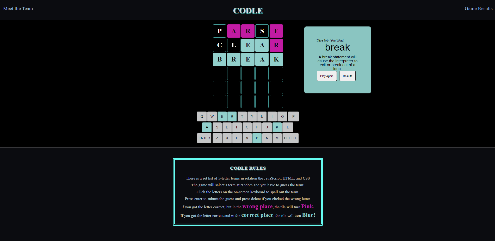
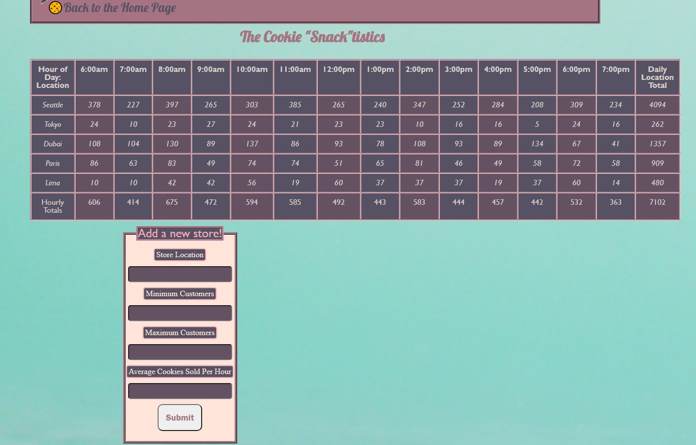
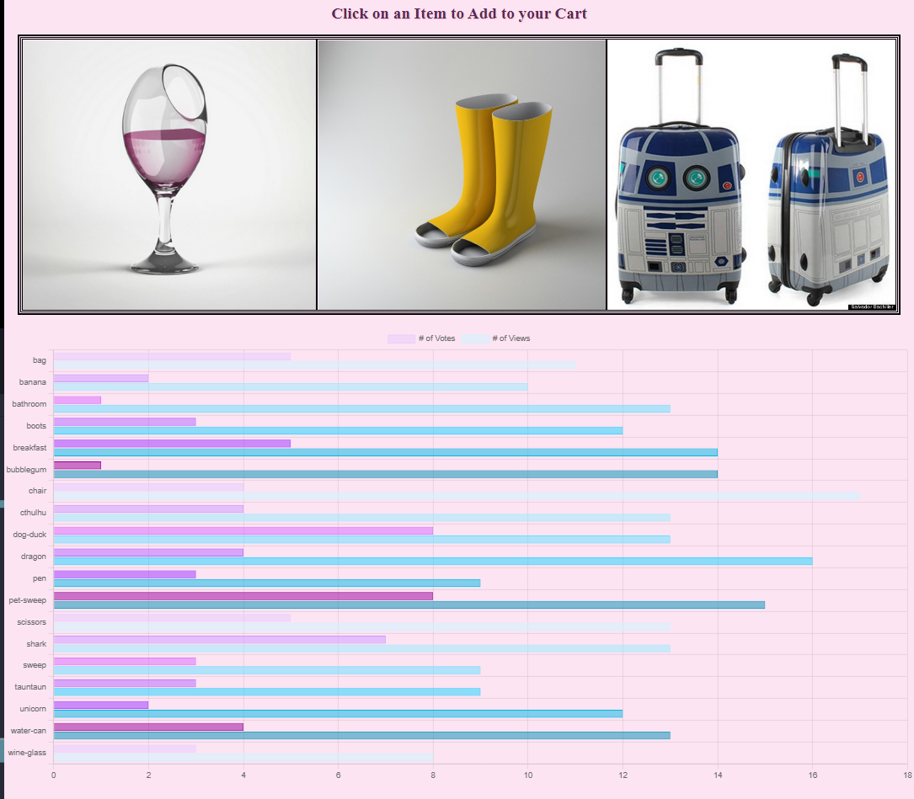
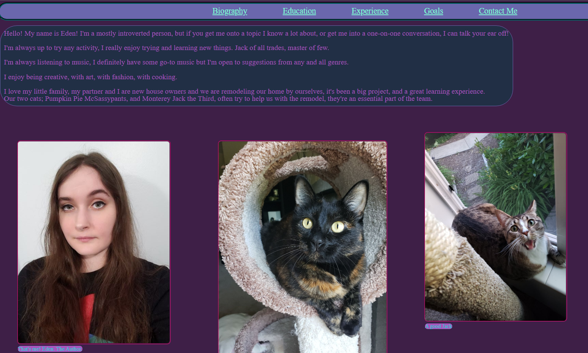

# Portfolio Prep
In your first few days of Code 301, you will build a personal portfolio site. This will help you establish a home on the web, and show off some of your software development projects and skills. 

Sometimes, the hardest part is getting the words right. To help you prepare for building your portfolio, you can start thinking about what you want to say now.

## Tell me about yourself
Visitors to your portfolio site want to learn about you, in memorable, bite-sized bits. Your page will have a space for you to fill in each of the following descriptions of yourself:

1. A 2 or 3 word catchy title. Avoid cliches like “programming ninja” or “coding rockstar”.
  : Not Sure Virus Programming Scientist 
2. A personal headline, like you have atop your LinkedIn page. What do you want your career to be about? 
  : I want my career to be about making a difference in science and medicine through the power of technology. 
3. Your professional pitch: You’ve done a recording, so just write down here how it goes.
  for now : 

I'm trained in the field of Virology Research and I've spent that career as a research scientist and manager for small labs. Where I conducted my own experimental design while managing a team to further the scientific research of Venezuelan equine encephalitis virus, and understanding of RNA viruses as a whole. 
 
During my time as a research scientist, a software engineer, out of the kindness of her heart, wrote us a simple program that changed a fundamental assay in our day to day life. 
This simple program made something that took us -hours- to complete, instead take -minutes- to complete. I was amazed and intrigued by just how a few lines of code could transform our experience in the lab. 
 
After seeing this I quickly decided that I wanted to pursue this path, and it just turned into a matter of "how." I had already attended university, and although I enjoyed my time at university, I wasn't keen on going back! I decided to explore other avenues, and having contact with a few people who attended Code Fellows and through that successfully inserted themselves into the industry. 
 
I decided to follow in their footsteps with the ultimate goal of going back into science with my software development skills. I want to advance virology research through the power of coding.  

4. What excites you the most about tech? Write 1-2 sentences.
  : Technology is in everything, it's the way of the world and the way of thinking that is required for it excites me, and drives me to be a better thinker, better problem solver, better me. I have first hand experience of seeing technology automate a complex assay into a few lines of code, imagine what it could do with the right minds behind it? 

## Gather your assets
A few punchy images will really help your page stand out, and make it your own. Gather images for the following:

1. A headshot of your lovely face, reduced to 100x100 pixels  it's me! 
2. A banner of you looking happy, cropped to exactly 1400 × 422 pixels  it's pumpkin :)  
3. A screenshot of the best-looking part of your favorite previous project, like your Code 201 final project  My teams final Code 201 project: CODLE and a round played/results pop up  
4. Two or three other nice-looking screenshots, of any other projects you have worked on. Salmon Cookies? Bus Mall? 
   My Salmon Cookies Lab DOM manipulated Table 
   My Bus Mall Results page/chart 
   My About me Bio and Cat family 
